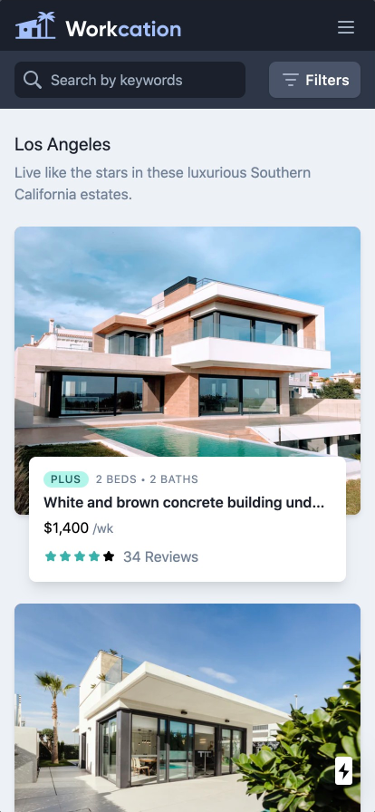
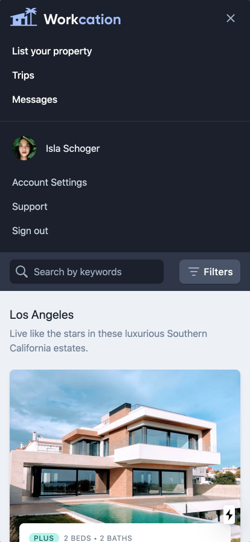
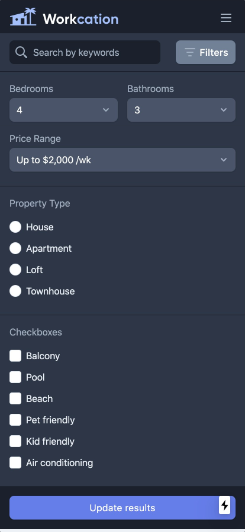
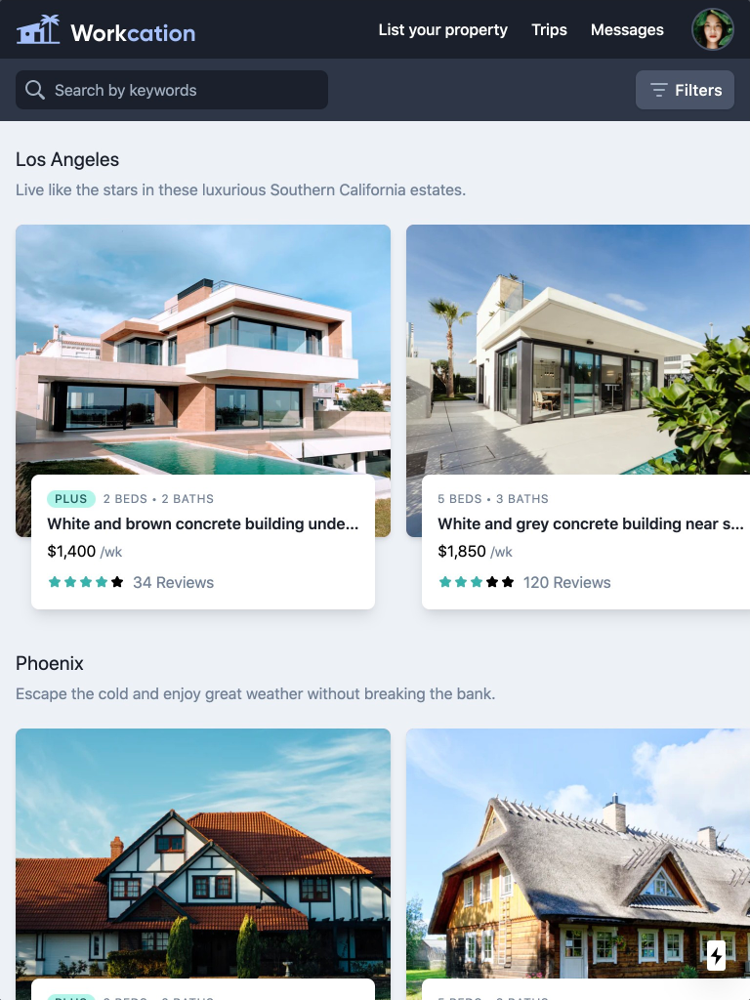
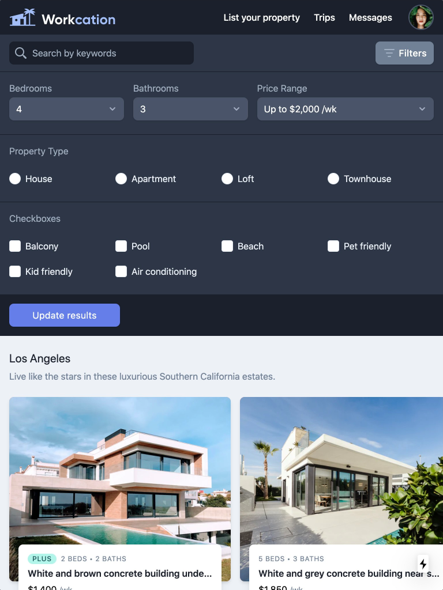
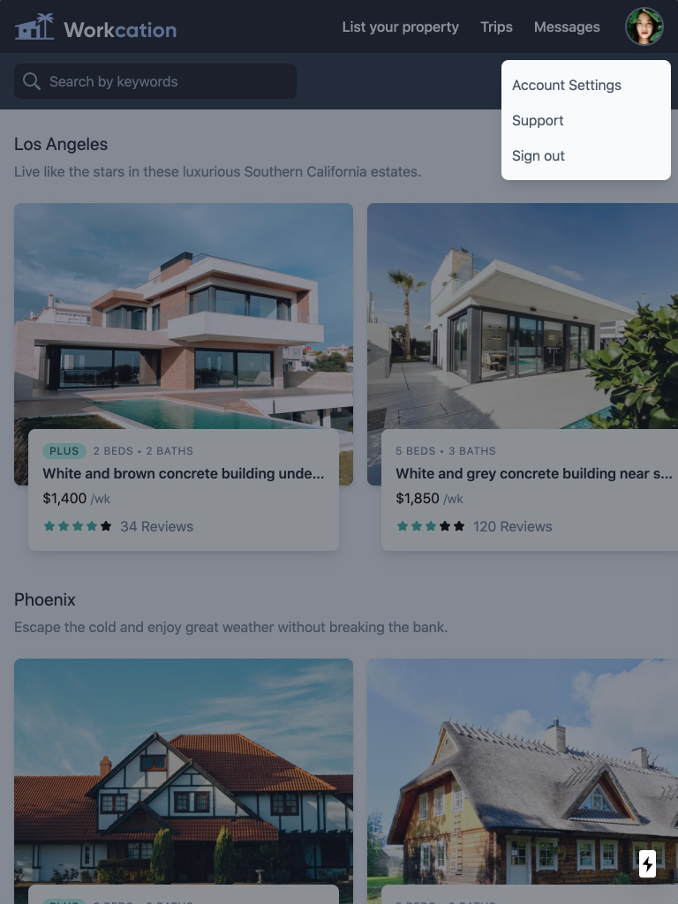
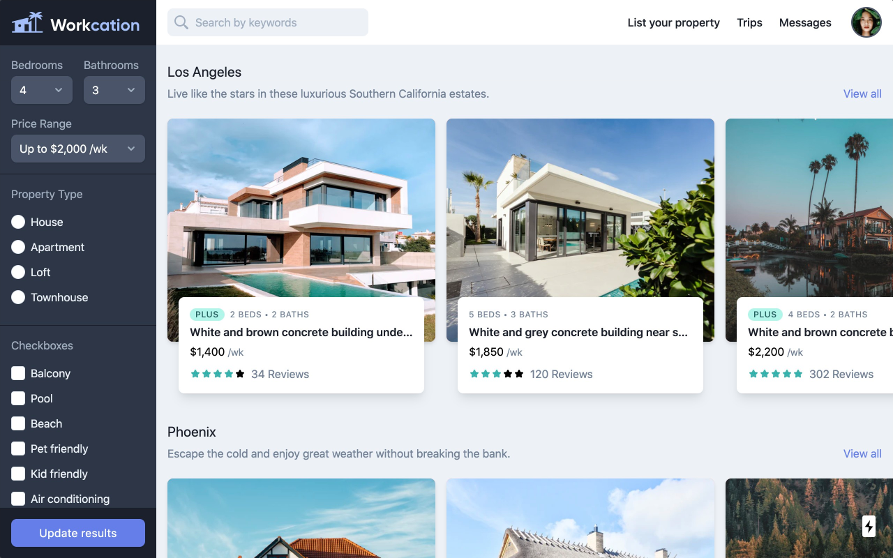

# Workcation mockup (React with Tailwindcss)

A mockup front-end for 'workcation' based on the [design](https://www.figma.com/file/SNUysoGLVJPm286sgXCEm2Ag/tailwind-course?node-id=0%3A1&viewport=5813%2C-667%2C0.3258124887943268) from Adam Wathan.

Made a couple of improvement on the implementation:
* *Single source of truth*:
  In the live stream of building workcation by Adam, a couple of input fields are implemented as redundant components for different view ports. (Dropdown menu, search bar).
  Reimplemented this whole design slightly differently so that every input field now is a single source of truth.

Run locally:
```bash
npm run dev
```
**tailwind is such a good tool!!!!!! it actually makes you think and learn css!!!!!!!**

### mobile




### ipad




### desktop
